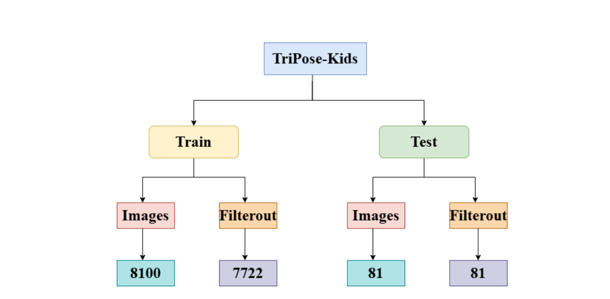
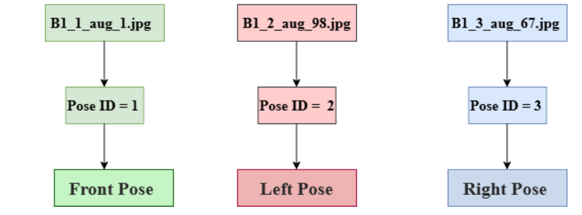
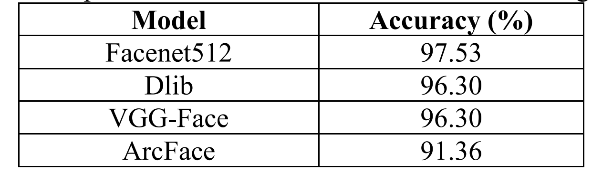

# Benchmarking Pose-Aware Child Face Recognition
Pose-aware child face recognition pipeline (Under Publication at ICICIC 2025)

🏆 Best Accuracy Achieved: 97.53% (FaceNet512)

## Why This Project Matters
Recognizing children's faces is significantly harder than recognizing adults.

Children:
- Have very similar facial structures
- Are still growing, causing facial changes
- Have fewer distinctive features
- Show high variation across poses

Most modern face recognition models are trained primarily on adult datasets.  
When applied to children, their performance often drops due to poor generalization.

This project focuses on building a structured and reliable pipeline specifically designed for child face identification.

## Dataset: TriPose-Kids
To conduct this study, we created a structured dataset called **TriPose-Kids**.

- 27 kindergarten students (15 boys, 12 girls)
- 3 facial poses per child:
  - Front
  - Left
  - Right
- Each pose augmented up to ~100 variations
- Total dataset size: ~8100 images
- All images resized to 256 × 256

### Dataset Structure

---

## System Pipeline Overview
The system follows a carefully designed multi-stage pipeline:

1. Face Detection (DSFD)
2. Face Cropping
3. Image Resizing (256×256)
4. Data Augmentation
5. Embedding Extraction
6. L2 Normalization
7. Outlier Filtering (Cosine threshold = 0.75)
8. Pose-Specific Embedding Averaging
9. Cosine Similarity Matching (Threshold = 0.65)

### Complete Pipeline Diagram

---

## Models Benchmarked
The following face recognition models were evaluated under identical preprocessing conditions:

- FaceNet512
- Dlib
- VGG-Face
- ArcFace

All models were accessed using the DeepFace framework to ensure consistent embedding extraction.

---

## What Makes This Approach Different?
Most systems average all embeddings across poses.

This system instead:

✔ Stores separate embeddings for front, left, and right poses  
✔ Compares test images only with embeddings of the same pose  
✔ Removes noisy embeddings using cosine similarity filtering  
✔ Applies L2 normalization for stable similarity comparison  

This pose-aware strategy reduces mismatches caused by pose differences.

Example:
If a test image is left-facing, it is compared only with stored left-facing embeddings.
                   

---

## Results

FaceNet512 performed best due to strong generalization and compatibility with high-resolution inputs.

### Model Comparison Visualization

---

## Key Technical Contributions

- Designed a pose-specific embedding pipeline
- Implemented cosine-based outlier filtering
- Applied L2 normalization for embedding stability
- Conducted structured benchmarking of four models
- Demonstrated 97.53% identification accuracy in a controlled setting

---

## Limitations

- Pose labeling relies on structured filenames
- Dataset size is limited (27 children)
- Controlled environment testing

---

## Future Improvements

- Automatic pose estimation instead of filename-based labeling
- Larger and more diverse datasets
- Deployment in real-world CCTV environments

---

## 🔐 Dataset Availability

Due to privacy and ethical considerations involving children, the TriPose-Kids dataset is not publicly available.
