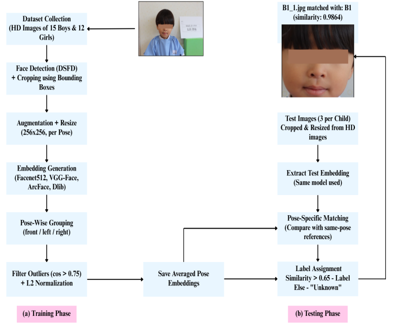

# System Pipeline

This section explains the complete processing flow from raw image to final identity prediction.

---

##1.Face Detection

Faces are detected using DSFD (Dual Shot Face Detector).  
Only the detected face region is retained for further processing.

---

##2.Face Cropping

The detected face bounding box is used to crop the face from the original image.

This removes background noise and irrelevant features.

---

##3.Image Resizing

All cropped faces are resized to **256×256 resolution** to maintain consistency across models.

Higher resolution improved performance for certain architectures.

---

##4.Data Augmentation

Each pose image is augmented to increase robustness:

- Horizontal flip
- Rotation
- Brightness variation
- Slight zoom
- Contrast adjustment

Each original pose image is expanded to approximately 100 samples.

Total dataset size: ~8100 images  
Subjects: 27 children  
Poses: Front, Left, Right

---

##5.Embedding Extraction

Each model generates a numerical representation (embedding) of the face.

These embeddings represent unique facial characteristics in vector space.

---

##6.L2 Normalization

All embeddings are normalized to unit length.

This ensures cosine similarity comparisons are stable and consistent.

---

##7.Outlier Removal

To improve embedding reliability:

- Cosine similarity is computed between embeddings of the same subject
- Embeddings with low similarity are removed
- Only consistent embeddings are retained

This reduces noise in the reference set.

---

##8.Reference Embedding Creation

Instead of merging all embeddings, they are grouped by pose:

- Front embeddings
- Left embeddings
- Right embeddings

Each pose has its own reference representation.

---

##10.Final Matching

Test image → Pose identified → Compared only with matching pose embeddings → Cosine similarity computed → Highest score selected.

---

